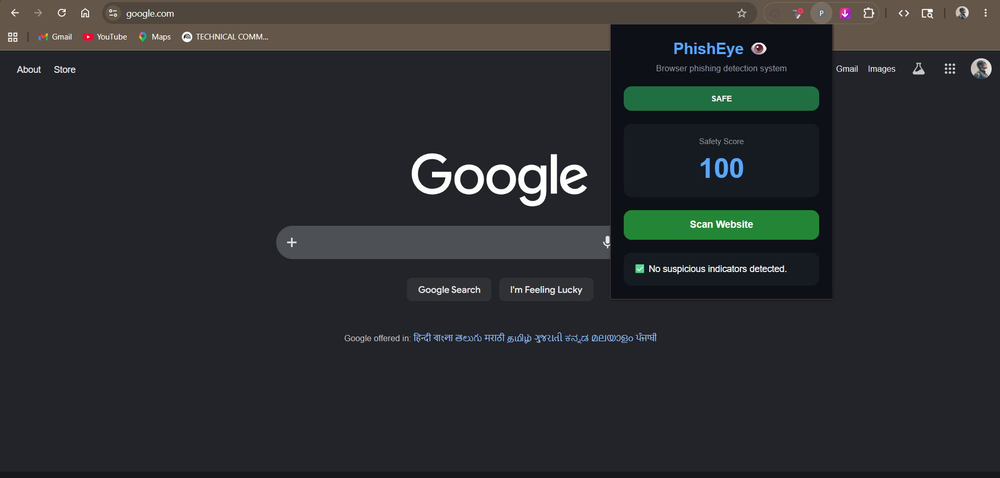
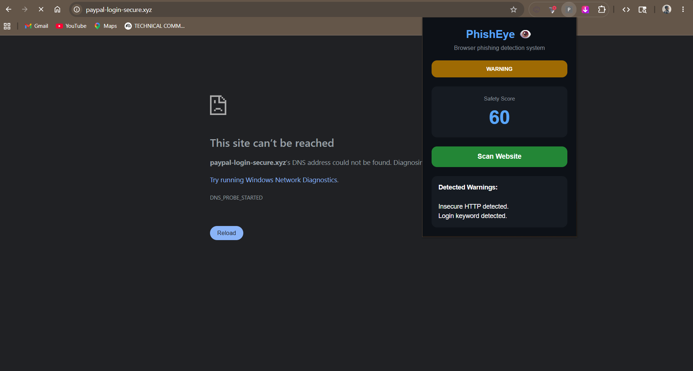
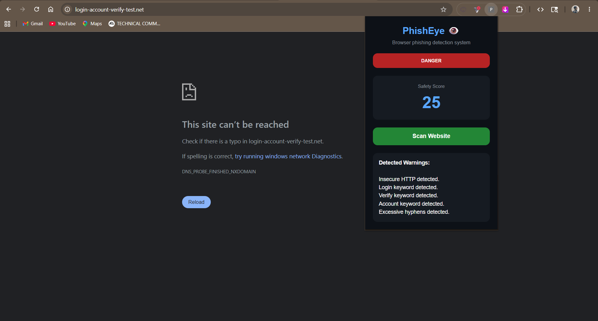

# PhishEye 👁️

Browser phishing detection extension under the JARVX cybersecurity ecosystem.

## Overview

PhishEye is a Chrome extension designed to identify potentially malicious websites using URL analysis and phishing heuristics. It helps users detect suspicious links before entering sensitive information.

## Features

### Phase 1

* URL scanning
* Safety scoring system
* HTTP detection
* Suspicious keyword detection
* Threat classification (Safe, Warning, Danger)

### Phase 2

* IP address URL detection
* Suspicious TLD detection
* Brand impersonation detection
* URL shortener detection
* Excessive subdomain detection
* Improved threat scoring

## Screenshots

### Safe Scan



### Warning Scan



### Danger Scan


## Installation

1. Clone the repository

```bash
git clone https://github.com/adithyaks2222-ops/PhishEye.git
```

2. Open Chrome and navigate to:

```txt
chrome://extensions
```

3. Enable Developer Mode

4. Click "Load unpacked"

5. Select the PhishEye project folder

## Project Structure

```txt
PhishEye/
│
├── popup/
│   ├── popup.html
│   ├── popup.css
│   └── popup.js
│
├── utils/
│   └── urlAnalyzer.js
│
├── Screenshots/
│
├── manifest.json
└── README.md
```

## Roadmap

### Completed

* Phase 1: Extension Foundation
* Phase 2: Advanced URL Intelligence

### In Progress

* Phase 3: Webpage Content Analysis

### Planned

* Threat Intelligence APIs
* On-page Warning Overlays
* AI Threat Explanations

## Tech Stack

* JavaScript
* HTML
* CSS
* Chrome Extension Manifest V3

## License

MIT License

```
```
# PhishEye 👁️

Browser phishing detection extension under the JARVX cybersecurity ecosystem.

## Overview

PhishEye is a Chrome extension designed to identify potentially malicious websites using URL analysis and phishing heuristics. It helps users detect suspicious links before entering sensitive information.

## Features

### Phase 1

* URL scanning
* Safety scoring system
* HTTP detection
* Suspicious keyword detection
* Threat classification (Safe, Warning, Danger)

### Phase 2

* IP address URL detection
* Suspicious TLD detection
* Brand impersonation detection
* URL shortener detection
* Excessive subdomain detection
* Improved threat scoring

## Screenshots

### Safe Scan


### Warning Scan


### Danger Scan



## Installation

1. Clone the repository

```bash
git clone https://github.com/adithyaks2222-ops/PhishEye.git
```

2. Open Chrome and navigate to:

```txt
chrome://extensions
```

3. Enable Developer Mode

4. Click "Load unpacked"

5. Select the PhishEye project folder

## Project Structure

```txt
PhishEye/
│
├── popup/
│   ├── popup.html
│   ├── popup.css
│   └── popup.js
│
├── utils/
│   └── urlAnalyzer.js
│
├── Screenshots/
│
├── manifest.json
└── README.md
```

## Roadmap

### Completed

* Phase 1: Extension Foundation
* Phase 2: Advanced URL Intelligence

### In Progress

* Phase 3: Webpage Content Analysis

### Planned

* Threat Intelligence APIs
* On-page Warning Overlays
* AI Threat Explanations

## Tech Stack

* JavaScript
* HTML
* CSS
* Chrome Extension Manifest V3

## License

MIT License

```
```
